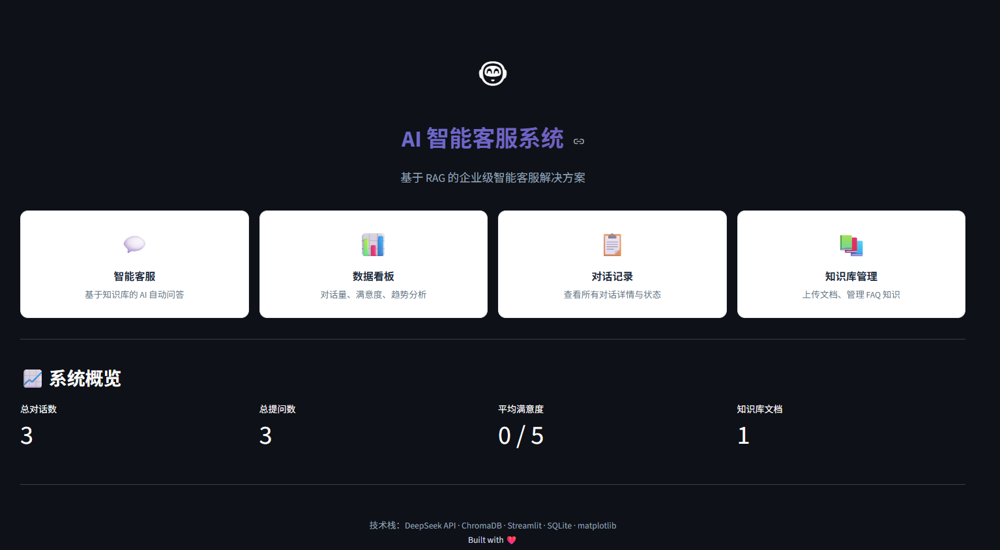
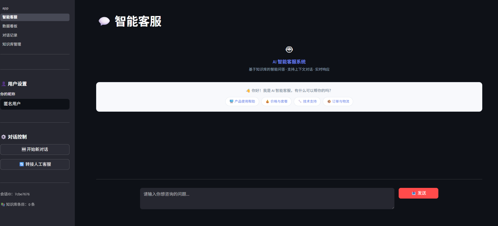
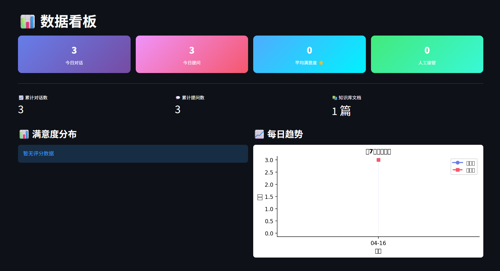
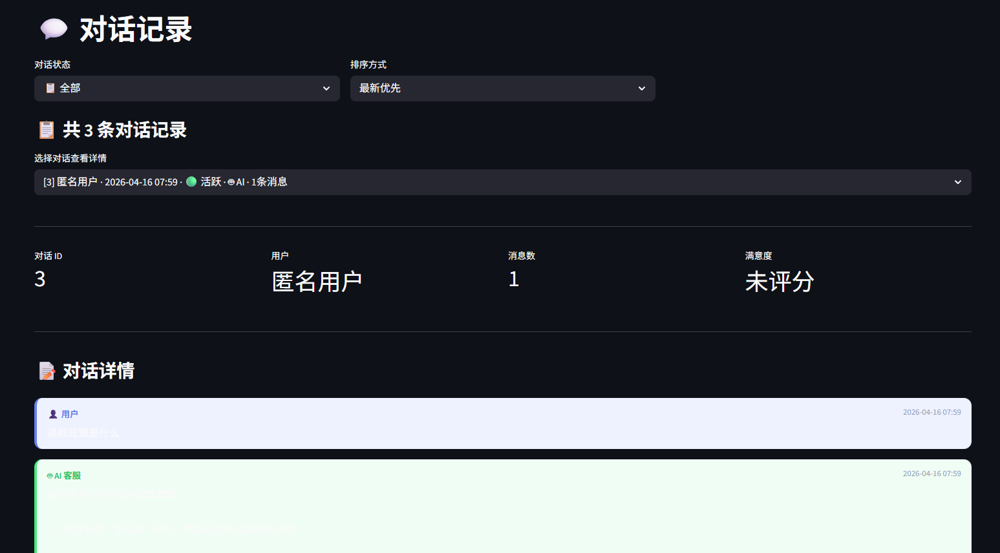
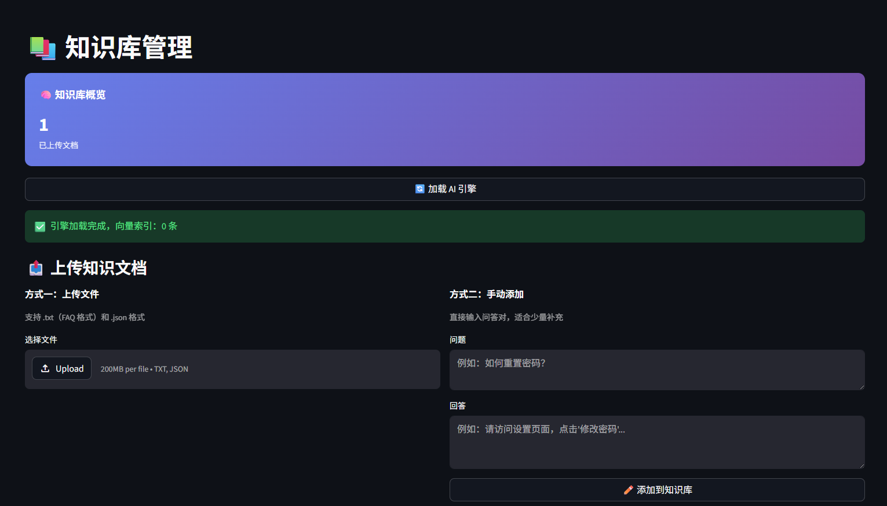

# 🤖 AI Customer Service System

> 基于 RAG（检索增强生成）的企业级智能客服系统，集成 DeepSeek API + ChromaDB + SQLite，提供完整的客服问答、数据统计和管理后台功能。

## ✨ 功能特性

### 💬 智能客服
- 基于 RAG 的知识库问答——AI 从 FAQ 文档中检索相关内容，生成精准回答
- 对话上下文记忆——自动保留最近 5 轮对话历史，理解上下文
- 满意度评分——用户可对回答打分（1-5 星），支持评论反馈
- 人工接管标记——复杂问题一键转接人工客服

### 📊 数据看板
- 实时统计——今日对话数、总提问数、平均满意度、知识库文档数
- 满意度分布图（matplotlib 饼图）
- 每日趋势图（近 7 天对话量折线图）
- 热门问题 TOP 10 排行

### 💬 对话记录
- 全量对话详情查看（用户消息 + AI 回复 + 知识来源）
- 按状态筛选（活跃/已结束/人工接管）
- 评分标签展示

### 📚 知识库管理
- 上传 FAQ 文档（支持 .txt 和 .json 格式）
- 手动添加问答对
- 知识检索测试——输入问题验证检索效果
- 知识库条目管理（查看/删除）
- 一键清空知识库

## 📸 截图预览

| 首页 | 智能客服 |
|:---:|:---:|
|  |  |

| 数据看板 | 对话记录 |
|:---:|:---:|
|  |  |

| 知识库管理 |
|:---:|
|  |

## 🏗️ 系统架构

```
用户输入 → AI 引擎 → DeepSeek API
                ↓
         ChromaDB 向量检索（知识库）
                ↓
         上下文记忆 + 知识增强提示词
                ↓
         生成回答 → 返回用户
                ↓
         SQLite 存储对话记录、评分、统计
```

### 技术栈

| 技术 | 用途 |
|------|------|
| [DeepSeek API](https://platform.deepseek.com/) | AI 对话生成 |
| [ChromaDB](https://www.trychroma.com/) | 向量数据库（知识库检索） |
| [Streamlit](https://streamlit.io/) | Web 界面框架（多页面架构） |
| [SQLite](https://www.sqlite.org/) | 对话记录与统计数据持久化 |
| [matplotlib](https://matplotlib.org/) | 数据可视化图表 |
| [Sentence-Transformers](https://www.sbert.net/) | 文本向量化（all-MiniLM-L6-v2） |

## 🚀 快速开始

### 1. 克隆仓库

```bash
git clone https://github.com/SsllF8/ai-customer-service.git
cd ai-customer-service
```

### 2. 安装依赖

```bash
pip install -r requirements.txt
```

### 3. 配置环境变量

复制 `.env.example` 为 `.env`，填入你的 DeepSeek API Key：

```env
DEEPSEEK_API_KEY=sk-your-api-key-here
```

> 获取 API Key：[DeepSeek 开放平台](https://platform.deepseek.com/)

### 4. 启动应用

```bash
streamlit run app.py --server.port 8501
```

浏览器访问 `http://localhost:8501` 即可使用。

## 📖 使用指南

### 首次使用

1. 进入「📚 知识库管理」页面
2. 点击「🔄 加载 AI 引擎」（首次需下载 Embedding 模型，约 90MB）
3. 上传 FAQ 文档或手动添加问答对
4. 回到「💬 智能客服」开始对话

### FAQ 文档格式

**TXT 格式：**
```
Q: 如何注册账号？
A: 点击首页右上角的"注册"按钮，填写手机号和验证码即可完成注册。

Q: 退款政策是什么？
A: 购买 7 天内支持无理由退款，请在"我的订单"中提交退款申请。
```

**JSON 格式：**
```json
[
  {"q": "如何注册账号？", "a": "点击首页右上角的注册按钮..."},
  {"q": "退款政策是什么？", "a": "购买7天内支持无理由退款..."}
]
```

## 📁 项目结构

```
ai-customer-service/
├── app.py                  # 主入口（首页）
├── ai_engine.py            # AI 引擎模块（RAG + DeepSeek）
├── database.py             # 数据库模块（SQLite）
├── requirements.txt        # Python 依赖
├── .env                    # 环境变量配置
├── knowledge_base/
│   └── default_faq.txt     # 示例 FAQ 文档
├── screenshots/            # 项目截图
├── data/                   # SQLite 数据库文件（自动生成）
├── pages/
│   ├── 1_智能客服.py        # 用户聊天页面
│   ├── 2_数据看板.py        # 数据统计看板
│   ├── 3_对话记录.py        # 对话记录管理
│   └── 4_知识库管理.py      # 知识库管理后台
```

## 💡 使用场景

### 企业客服
- **电商客服**：上传商品 FAQ、退换货政策，AI 自动回答常见问题
- **SaaS 产品**：导入产品文档、使用教程，降低人工客服成本
- **教育机构**：录入招生政策、课程信息，24 小时自动答疑

### 个人项目
- **作品集展示**：展示全栈 AI 应用开发能力
- **技术学习**：深入理解 RAG 原理、向量检索、数据库设计
- **面试加分**：多页面架构、数据持久化、数据可视化等技术亮点

## 🎯 与其他项目的区别

| 特性 | 前五个项目 | 本项目 |
|------|-----------|--------|
| 数据存储 | 无/文件 | **SQLite 数据库** |
| 页面架构 | 单页面 | **多页面（5 页）** |
| 数据可视化 | 无 | **matplotlib 图表** |
| 后台管理 | 无 | **完整的 CRUD 管理** |
| 复杂度 | 低-中 | **高** |

## 📄 License

MIT License
